# How to Set Up

## MongoDB Atlas

1. Sign up Mongodb atlas

[Visit mongodb.com](https://www.mongodb.com/)

2. Set organization, project name choose 'python' for prefferd language

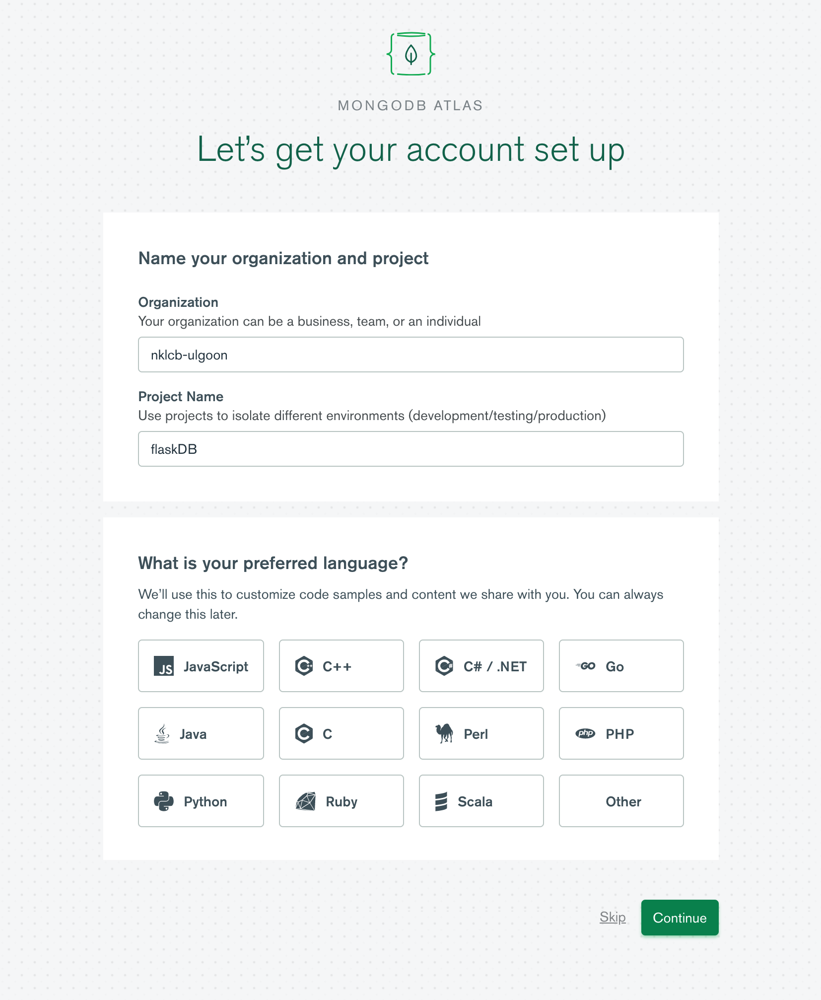

3. choose shared plan

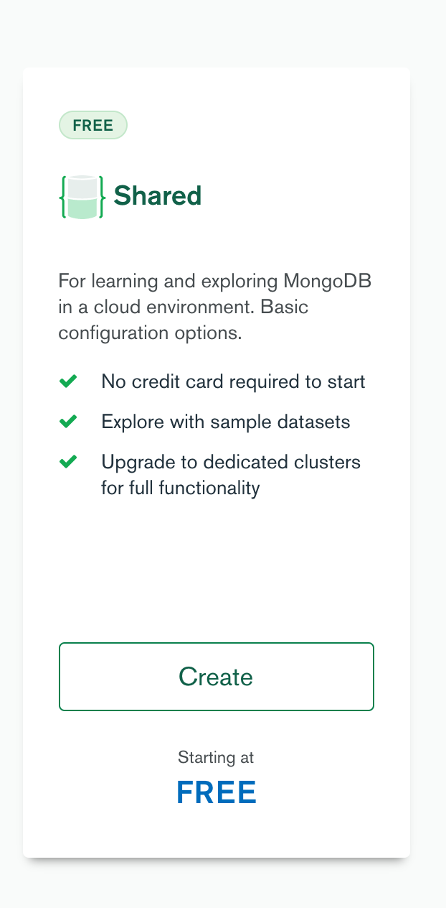

4. Set these options

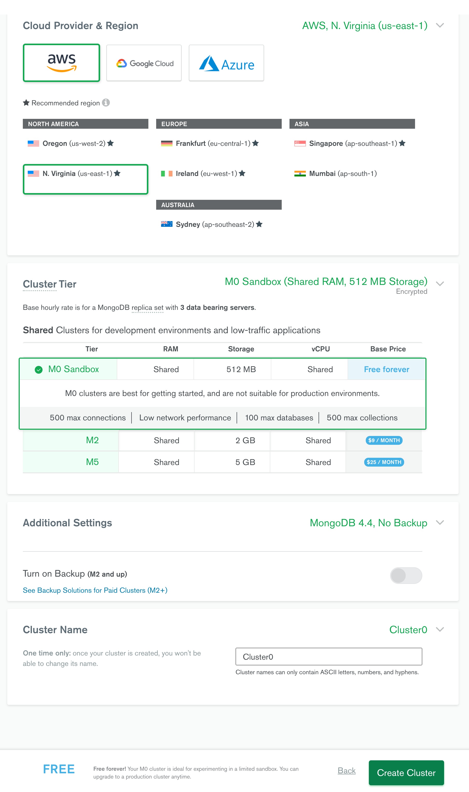

5. Add new database user

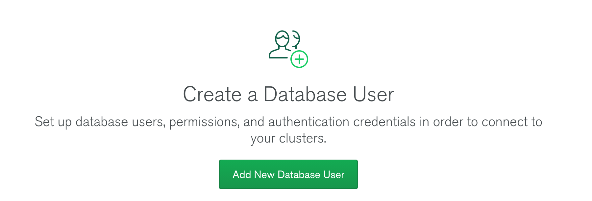
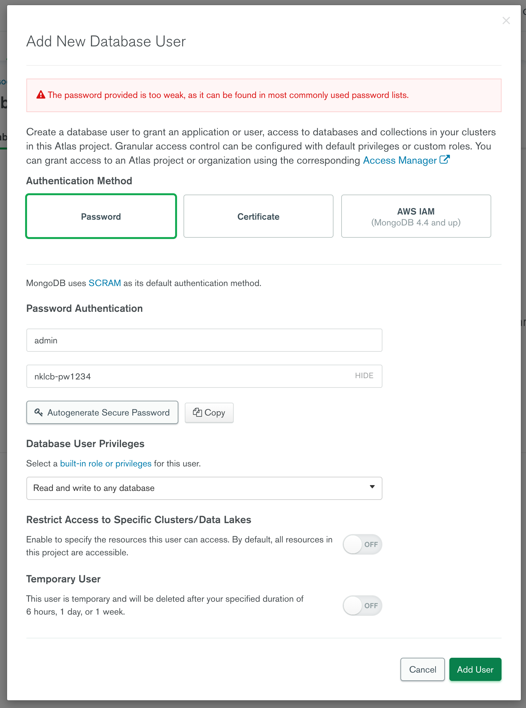

6-1. Press connect button to allow all ip address

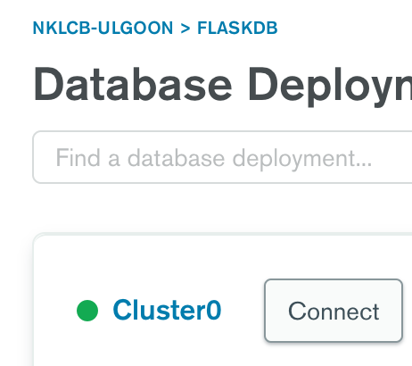

6-2. Press Allow Access from Anywhere
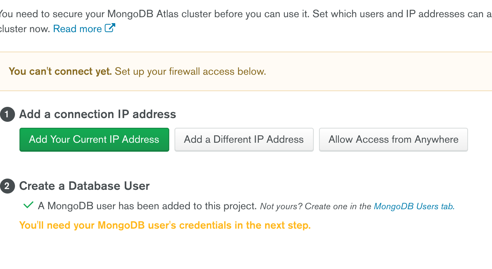
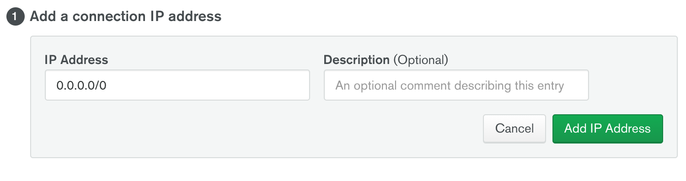

6-3. Press this section and get uri
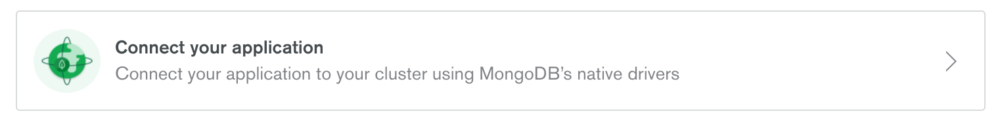
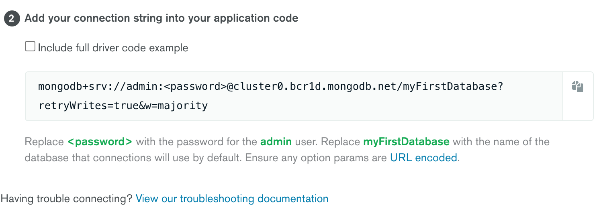

6-4. paste your mongouri into backend/config/dev.py


## Start AWS and get S3 bucket

1. Sign up Amazon Web Service

[https://aws.amazon.com/](https://aws.amazon.com/)

2. Click Storage-S3

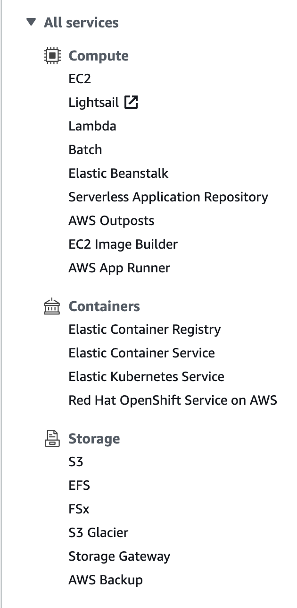

3. Create bucket

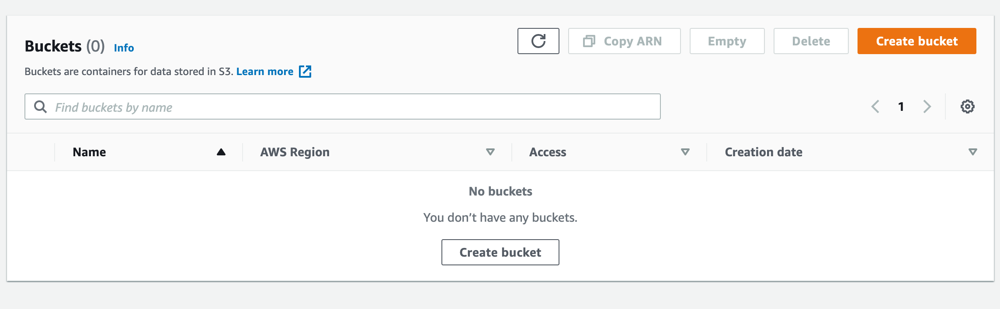

4-1. set bucket name unique.

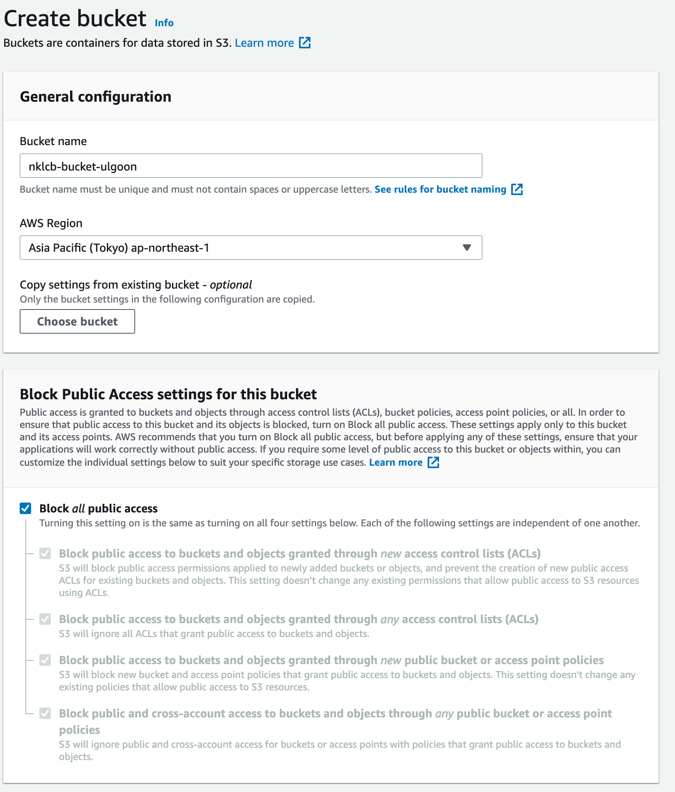

4-2. !Important : You should uncheck `Block all public access` to alow all public access

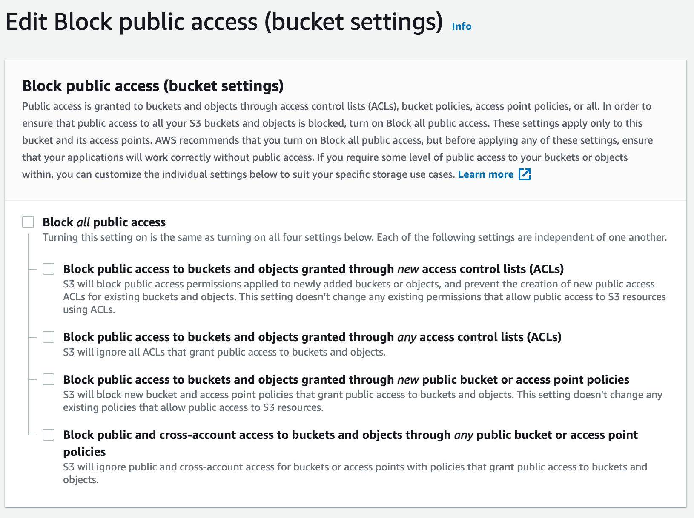

5-1. Click Down Arrow - My Security Credentials

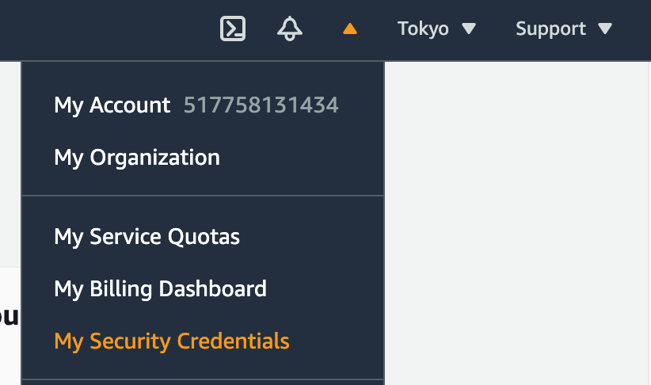

5-2. Create and download Access Keys

## Don't upload access key, secret key to github

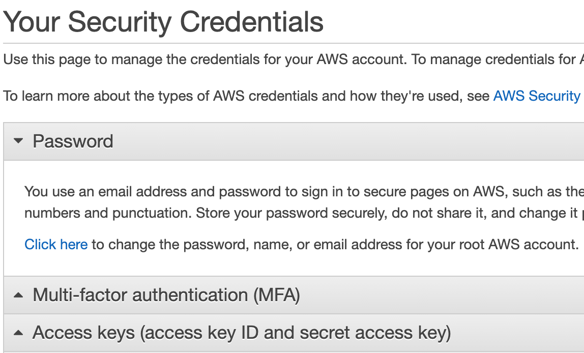

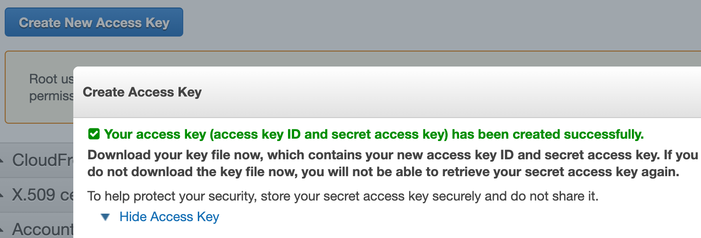

5-3. Fill this keys and names into backend/img/__init__.py

```
AWS_ACCESS_KEY: AWSAccessKeyId
AWS_SECRET_KEY: AWSSecretKey
BUCKET_NAME: Your bucket name
```
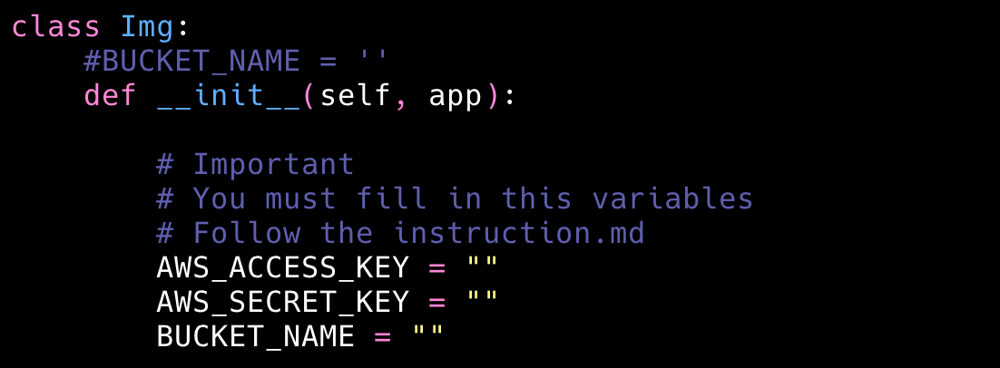